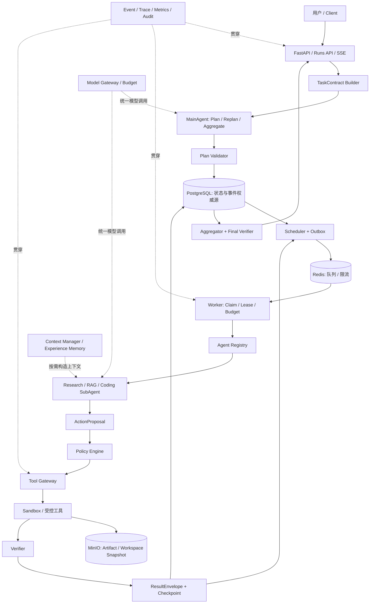
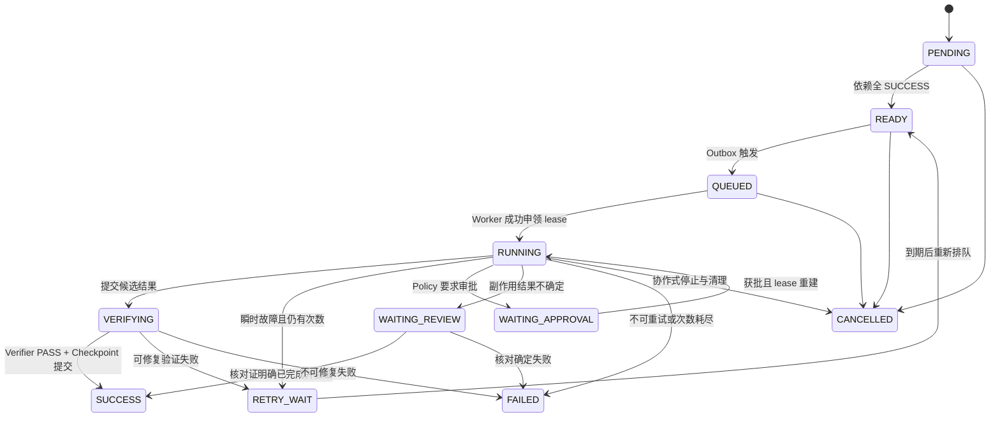

# Secure Hierarchical Multi-Agent Runtime Framework｜Work 项目执行蓝图

> 版本：V0.1 执行基线  
> 文档用途：供后续 Work 模式按阶段实施、验证和交付  
> 核心约束：**先完成可运行、可测试、可恢复、可审计的最小闭环，不继续扩架构。**

## 0. 项目定位、目标与范围冻结

本项目是一个 **Secure Hierarchical Multi-Agent Runtime Framework**：MainAgent 负责把用户目标拆成有依赖的 Task DAG、选择能力并汇总结果；Runtime 负责确定性调度、执行、恢复及权限边界；SubAgent 只在被分配的任务和上下文内工作。它借鉴图状态机思想，但 V0.1 自行实现小型、可解释的 Runtime，不把某个工作流库当作项目本身。

V0.1 的交付目标只有一条：从 `TaskContract` 进入，经过 `MainAgent → Task DAG → Plan Validator → Scheduler → Worker → Agent Registry → SubAgent → ActionProposal → Policy → Tool Gateway → Sandbox → Verifier → Checkpoint → Aggregator → Trace`，使一个真实 Demo 完成，并能对关键故障定位、恢复和审计。首批示例 Agent 固定为 `ResearchAgent`、`RAGAgent`、`CodingAgent`；若为了先打通链路，需要暂用确定性 Planner 或模拟 Model Gateway，应明确记录替换点，但不得省略运行时边界。

**交付解释**：Phase 1～7 是开发顺序，不等于七期独立平台。V0.1 完成标准见末尾 Definition of Done。目录和接口为实施蓝图，细节可在测试证据支持下调整；新增基础设施或 Agent 类型须证明它是当前最小闭环的阻塞项。

## 1. 核心设计原则

| 原则 | 工程含义 |
|---|---|
| MainAgent decides; Runtime executes | 模型生成计划和动作意图；状态转换、工具执行和资源分配由确定性代码控制。 |
| Scheduler dispatches; SubAgent executes | SubAgent 不直接生成或调用子 Agent；若需新增任务，提交变更建议，由 MainAgent 重规划并经 Plan Validator。 |
| Prompt ≠ Permission | 提示词中的“允许”不能放宽结构化授权；有效权限是用户、Agent Manifest、Task、工具和环境策略的交集。 |
| Agent result ≠ truth | Agent 的“完成”声明只是一份候选结果；Verifier 通过后才标记 `SUCCESS`。 |
| State ≠ Memory | RunState 管当前执行；Memory 保存跨任务可复用经验。只有经验证的经验可进入可信记忆。 |
| Retry ≠ Recovery | 恢复需要状态、工作区、幂等记录和外部副作用核对；重试仅是其中一种动作。 |
| 最小必要上下文 | SubAgent 只接收当前任务、必要上游结果、证据引用和可用工具。 |
| 每一步可追踪 | 计划、状态转换、模型调用、权限决定、工具执行、验证和检查点均关联 `run_id` / `task_id` / `trace_id`。 |
| 默认拒绝 | 未注册能力、未授权工具、超预算动作或无法确认安全边界时拒绝执行并记录事件。 |

## 2. 总体架构图



`PostgreSQL` 中状态和 append-only 事件记录是查询与审计基线；`Redis` 只负责投递与运行时加速，不能作为唯一任务事实来源。对象数据进入 `MinIO`，数据库只保存 URI、校验和、所有者及版本引用。

## 3. 模块职责与边界

| 模块 | V0.1 职责 | 明确边界 |
|---|---|---|
| MainAgent | 理解目标、产生 Task DAG、必要时受限重规划、整合经验证结果 | 不直接调用 Shell、数据库、Sandbox 或外部 API。 |
| SubAgent | 在指定 `Task`、`AgentContext` 与能力内提出动作，产出 `ResultEnvelope` 草稿 | 不绕过 Policy/Tool Gateway；不私自派生 Agent。 |
| Runtime | 统一任务生命周期、Worker、预算、租约、取消、故障分类 | 决定执行事实；不让自然语言输出直接修改状态。 |
| Plan Validator | 验证 DAG 无环、依赖存在、能力可匹配、预算、权限与任务上限 | 计划不合格时拒绝或返回修正请求。 |
| Agent Registry | 保存版本化 `AgentManifest`，按 capability 匹配 Agent | 不以 Prompt 中的 Agent 名称代替注册。 |
| Policy | 计算有效权限、风险级别、审批要求与拒绝原因 | 默认拒绝；审批结果不能越过系统硬边界。 |
| Tool Gateway | 参数 Schema、权限、速率、密钥注入、幂等键、审计、结果标准化 | Agent 无直接工具句柄；真实密钥不进入模型上下文。 |
| Sandbox | 对不可信代码和可逆文件操作施加文件、网络、用户、CPU、内存、时间限制 | V0.1 Docker 隔离需明确威胁模型；高风险外部写入不由 Sandbox 代替审批。 |
| Verifier | 对证据、产物、测试结果和业务接受标准做独立核验 | 不把 Agent 自报状态直接视为 PASS。 |
| Checkpoint | 保存逻辑状态、已完成任务、预算、产物与工作区快照引用 | 关联快照完整性；不能只保存会话文本。 |
| Memory | 记录经过验证的 Goal/Trajectory/Artifact/Outcome 经验 | V0.1 仅实现 Experience Memory 的最小结构化存取；不引入复杂长期记忆体系。 |
| Context | 按任务汇集最小必要上下文、隔离敏感及无关信息 | 保留引用和裁剪理由，便于评测上下文大小与成功率。 |
| Observability | 结构化事件、关联 Trace、日志、指标、审计查询 | V0.1 不做完整 Event Sourcing；日志避免泄露密钥和原始敏感内容。 |
| Artifact | 保存补丁、报告、证据和 Snapshot，返回不可变版本引用 | 数据库保存元数据，不存大文件正文。 |
| Model Gateway | 统一模型请求、超时、预算、响应 Schema 和模型版本记录 | V0.1 单一配置模型即可；复杂路由后移。 |
| Persistence | PostgreSQL Repository、迁移、Outbox；Redis Adapter；MinIO Adapter | 适配器隔离基础设施，断线后可从 PostgreSQL 重建待执行任务。 |
| Aggregator / Final Verifier | 汇总各 `ResultEnvelope`、处理矛盾、核查最终交付满足 TaskContract | 失败任务不可被静默描述为成功。 |

## 4. 七个核心 Schema

所有 Schema 采用版本字段 `schema_version`（初始 `1`）、稳定 ID、UTC 时间和显式枚举；字段命名及可选性由 Phase 1 固化为 JSON Schema。下表为最小字段合同，后续增加字段必须有迁移与兼容测试。`AgentContext`、`TaskPlan`、`ArtifactRef` 可以作为嵌套值/服务接口，但不另增 V0.1 核心顶层 Schema。

| Schema | 必需字段 | 关键约束与用途 |
|---|---|---|
| `TaskContract` | `schema_version, run_id, goal, constraints[], acceptance_criteria[], permissions[], context_refs[], budget, created_at` | `budget` 至少含 `max_steps, max_llm_calls, max_tool_calls, timeout_seconds`；入口权限只能由可信 API 层赋予；外部提交不得自授权限。 |
| `Task` | `schema_version, task_id, run_id, goal, capability, depends_on[], status, priority, attempt, max_attempts, agent_id?, input_refs[], output_refs[], idempotency_scope, created_at` | `task_id` 在 run 内唯一；依赖只能指向同 run；任务不可在未满足依赖时进入 `READY`。 |
| `AgentManifest` | `schema_version, agent_id, version, capabilities[], allowed_tools[], forbidden_tools[], model_profile, risk_ceiling, timeout_seconds, max_steps` | Registry 从受信配置加载；版本在 run 启动时固定，且与 Task 能力和权限交叉验证。 |
| `RunState` | `schema_version, run_id, status, plan_version, task_ids[], completed_task_ids[], budget_used, checkpoint_ref?, final_result_ref?, updated_at` | 当前状态是权威快照；事件和 Checkpoint 可解释其演变。可恢复 run 还需 `last_consistent_checkpoint`。 |
| `ActionProposal` | `schema_version, action_id, run_id, task_id, agent_id, tool, operation, arguments, reason, risk_level, idempotency_key?, created_at` | 只是执行意图；Policy 决定能否执行，Gateway 再校验参数。外部写入必须有稳定幂等键。 |
| `ResultEnvelope` | `schema_version, run_id, task_id, agent_id, status, summary, data, artifacts[], evidence[], verifier, error?, metrics, completed_at` | `verifier` 含 `status, verifier_id, checks[]`；`SUCCESS` 只能在验证通过后落库。证据与产物应为不可变引用。 |
| `Event` | `schema_version, event_id, run_id, task_id?, sequence, type, actor, trace_id, payload, occurred_at` | Run 内单调序号；append-only；敏感参数只存脱敏摘要和引用；保留状态转换前后值及原因。 |

示例入口合同（授权由可信入口填充，非用户自由声明）：

```json
{
  "schema_version": 1,
  "run_id": "run_demo_001",
  "goal": "基于本地知识库资料分析示例项目中的登录异常并给出最小修复补丁",
  "constraints": ["仅修改演示仓库", "不访问生产系统", "不新增外部依赖"],
  "acceptance_criteria": ["补丁可复现", "相关 pytest 用例通过", "结论附证据引用"],
  "permissions": ["repo.read", "repo.write.sandbox", "sandbox.execute", "rag.search.local"],
  "context_refs": ["fixture://login-incident"],
  "budget": {"max_steps": 20, "max_llm_calls": 12, "max_tool_calls": 30, "timeout_seconds": 600},
  "created_at": "2026-09-23T00:00:00Z"
}
```

**一致性规则**：`TaskContract.permissions` 是上限，最终工具权限还需与 Manifest、Task 和环境 Policy 求交；`ResultEnvelope.status=SUCCESS` 与 `Task.status=SUCCESS` 必须在同一状态提交路径中由 Verifier PASS 触发。`Event` 为事实记录，`RunState` 为当前视图，`Checkpoint` 为恢复点，三者角色不可互换。

## 5. 完整任务执行链路

1. API 接收目标与可信授权信息，构造、验证并持久化 `TaskContract`，返回 `run_id`；同时记录 `RUN_CREATED`。
2. MainAgent 在预算和 Manifest 列表约束下生成计划；`Plan Validator` 检查无环、依赖完整、能力可映射、任务数/预算/权限上限。失败则记录拒绝原因，最多有限次修正，不无限自循环。
3. PostgreSQL 原子保存计划版本、`Task`、依赖、事件；Scheduler 将没有未完成依赖的任务置为 `READY`，同一事务写 Outbox。
4. Outbox Publisher 将待派发任务推入 Redis；Worker 领取前在 PostgreSQL 以条件更新申领任务、记录 `attempt` 与带到期时间的 lease。重复消息若已被申领或完成，安全跳过。
5. Worker 根据 Registry 选择 Manifest，Context Manager 取 Task、必要上游结果、证据与授权工具；Model Gateway 记录模型配置及用量。
6. SubAgent 对每个工具调用产出 `ActionProposal`；Policy 决定 `ALLOW`、`DENY` 或 `WAITING_APPROVAL`。允许后 Tool Gateway 做参数与资源限额检查，将可逆代码/文件操作送入任务 Sandbox，外部动作经受控 Connector。
7. 执行结果形成 ArtifactRef、证据和候选 `ResultEnvelope`；Verifier 运行硬检查（Schema、文件哈希、测试、证据引用、权限记录），PASS 后原子提交 `Task=SUCCESS`、事件、预算、结果及 Checkpoint 引用。软判断只能作为补充，不能覆盖硬失败。
8. Scheduler 重新计算 READY；所有叶节点完成后 Aggregator 依据各 Task 的经验证结果生成最终答案，Final Verifier 对照 `acceptance_criteria` 验证，随后 `Run=COMPLETED`。
9. API 通过 `GET /runs/{id}`、`GET /runs/{id}/tasks`、`GET /runs/{id}/events` 和 SSE 输出状态；取消入口 `POST /runs/{id}/cancel` 禁止后续派发并清理 lease/Sandbox。

**失败分支**：执行异常先按 Failure Taxonomy 分类。瞬时失败在限额内退避重试；验证失败记录证据并决定修复/重试；不可重试或次数耗尽进入 `FAILED` 与 DLQ；不确定的外部副作用进入 `WAITING_REVIEW`，禁止自动重放。

## 6. 状态机与不变量

`Task` 主路径：



`Run` 状态：`CREATED → PLANNING → RUNNING → VERIFYING → COMPLETED`；旁支为 `WAITING_APPROVAL`、`WAITING_REVIEW`、`FAILED`、`CANCELLED`。`COMPLETED/FAILED/CANCELLED` 为终态；对终态的再次执行应创建新的 run，并引用原 run 与可复用的经验证产物，不悄悄改写历史。

状态转换必须携带 `expected_status` 和版本号作条件更新；同一 Task 的成功提交只能发生一次。`PENDING` 的下游任务在上游失败时保持未就绪，并随 Run 进入终态或明确的重规划流程。租约到期只能触发核对与重新申领，不代表外部副作用可以自动重放。取消先阻止新派发，再通知 Worker、终止 Sandbox、释放资源、保存最后一致状态。

## 7. DAG、Plan Validator 与 Scheduler

V0.1 的 Task DAG 是有限、无环、有唯一 ID 的静态计划。重规划只在明确失败后创建 `plan_version + 1`，必须保留已经成功的任务和审计轨迹；动态无限生成 Task、递归 SubAgent 层级暂不实现。

Plan Validator 至少检查：

- Task 数量与深度上限；ID 唯一；`depends_on` 不存在自身引用、悬挂引用或环。
- 每个 capability 能被版本固定的 AgentManifest 提供；Agent 可用工具不得超出 `TaskContract` 权限和 Policy。
- 并行任务是否争用同一可写工作区；冲突时改为顺序执行或使用独立 Snapshot。
- `acceptance_criteria` 能映射到可运行 Verifier；预算、超时、风险级别符合上限。

Scheduler 只做确定性决策：依赖全部 `SUCCESS` 才 `READY`，按优先级与 FIFO 派发，在 `max_concurrency`、模型调用预算及 Sandbox 容量内运行。`T1 → {T2,T3} → T4` 的测试必须证明：T2 与 T3 可并发；若 T3 失败，T4 不运行；T3 经过成功重试后 T4 才 READY。排队与 PostgreSQL 状态不一致时，以数据库为准做 reconciliation；Outbox Publisher 允许重复投递，Worker 必须幂等领取。

## 8. 安全、Policy、Tool Gateway 与 Sandbox

有效权限由 `TaskContract ∩ AgentManifest ∩ Task ∩ Tool Policy ∩ Environment` 决定。风险分级：`L0` 本地/受控只读；`L1` Sandbox 中可逆写入与测试；`L2` 外部写入；`L3` 部署、删除等高影响动作。V0.1 Demo 只执行 L0/L1；L2 可用模拟 Connector 证明审批与幂等流程，真实外部写入须另行接入；L3 默认拒绝并记录，后续版本才考虑审批执行。用户对框架的授权不得被某个 Agent 的自由文本扩大。

Tool Gateway 对每次动作执行：身份与权限检查 → 结构化参数验证 → 速率/预算限制 → 必要密钥注入 → 执行 → 输出大小限制/脱敏 → 事件和审计写入。工具只暴露白名单操作，命令执行使用受控命令和工作区路径。对搜索网页、仓库文件和 RAG 内容按不可信数据处理，忽略其中要求改变权限、泄露密钥或跳过检查的指令。

Sandbox Manager 的 V0.1 接口为 `create / execute / snapshot / restore / collect_artifacts / destroy`。默认以非 root 身份运行，禁止特权模式和宿主 Docker socket，挂载最小工作目录，网络默认断开；设置 CPU、内存、进程数、磁盘/输出大小及执行超时上限。只读任务获得只读挂载；CodingAgent 使用独立可写 Snapshot，补丁和测试结果经校验后才发布到 Artifact Store。工作区快照与 Checkpoint 同步引用，恢复时核对哈希，避免逻辑状态已回滚而文件仍停留在后续版本。Docker 提供 V0.1 所需基础隔离，风险更高的多租户不可信代码执行需要后续更强隔离与专门评估。[Docker 安全文档](https://docs.docker.com/engine/security/)

## 9. Retry、Checkpoint、Idempotency、Compensation、DLQ

| 机制 | V0.1 规则 | 必须验证的故障 |
|---|---|---|
| Retry | 仅对明确瞬时错误（超时、429、短暂连接失败）最多 3 次，指数退避加抖动；Schema/权限/测试断言失败不盲重试。 | 同一消息重复到达不会重复提交 SUCCESS；次数用尽停止。 |
| Checkpoint | 每个经验证 Task 成功后记录 Run/Task 状态、预算、产物及 Workspace Snapshot 哈希；恢复时跳过已成功 Task。 | Worker 宕机后 T1/T2 不重跑，只恢复未完成的 T3。 |
| Idempotency | 内部键含 `run_id + task_id + action_id/operation`；外部 Connector 还需目标系统支持的稳定键或读后核对协议。 | DB 已提交但 ACK 未发送时重新投递不重复执行。 |
| Compensation | 对可撤销外部动作登记反向操作、状态和失败处理；V0.1 用模拟 Connector 验证，不宣称跨系统原子事务。 | 后续步骤失败时补偿一次，补偿失败进入人工核对。 |
| DLQ | 达到重试上限或不可恢复时将任务、错误类别、尝试次数、证据引用和最后 Checkpoint 写入 PostgreSQL 的死信记录；Redis 可有通知队列。 | DLQ 可查询、可审计、可人工决定新 run；不会永久循环。 |

建议 Failure Taxonomy：`TRANSIENT`、`VALIDATION`、`POLICY_DENIED`、`BUDGET_EXCEEDED`、`SANDBOX_VIOLATION`、`EXTERNAL_EFFECT_UNKNOWN`、`CANCELLED`、`INTERNAL_ERROR`。恢复路径先验证数据库状态，再检查 Snapshot 和工具副作用；只有确认安全，才重入 READY。若副作用结果不确定，则暂停在 `WAITING_REVIEW`。Transactional Outbox 解决“Task 已 READY、队列却未收到消息”的双写窗口；同一数据库事务写状态和 Outbox，再由 Publisher 异步投递。Redis Streams 消费组可用于投递与 ACK，但业务完成依据仍在 PostgreSQL。[Redis Streams 文档](https://redis.io/docs/latest/develop/data-types/streams/)

## 10. PostgreSQL、Redis、MinIO 职责边界

| 组件 | 保存内容 | 宕机与恢复规则 |
|---|---|---|
| PostgreSQL | `runs`、`tasks`、依赖、当前状态、事件、Checkpoint 元数据、Outbox、审批、审计、幂等记录、Artifact 元数据、DLQ | 唯一权威源；迁移版本固定；定期备份并做恢复演练。并发领取使用事务与条件更新/行锁。 |
| Redis | Task 投递、短期缓存、速率限制、可重建的暂态信号 | 丢失后从 PostgreSQL 的 READY/QUEUED、Outbox 和租约扫描重建；不存唯一成功事实。 |
| MinIO | 补丁、报告、证据文件、日志片段、Workspace Snapshot | 对象使用不可变版本/内容哈希；PostgreSQL 保存引用与校验和；对象缺失时报告不一致并停止恢复。 |

V0.1 可在 Docker Compose 中启动三项服务；Milvus、Neo4j、Kafka 不作为启动或验收前置。RAGAgent 先用本地固定文档集和轻量检索索引，Experience Memory 可先结构化存在 PostgreSQL；向量库/图数据库是否引入由后续评测决定。PostgreSQL 的行锁机制可支撑并发领取设计，具体 SQL 与隔离级别须在集成测试中验证。[PostgreSQL `SELECT` 文档](https://www.postgresql.org/docs/current/sql-select.html)

## 11. V0.1 项目目录与技术栈

目录以最小可运行实现为准，先建立必要文件，未实现的未来能力不创建空壳模块：

```text
agent-framework/
├── README.md
├── pyproject.toml
├── .env.example
├── docker-compose.yml
├── Dockerfile
├── docs/
│   ├── architecture.md
│   ├── contracts.md
│   ├── operations.md
│   └── adr/
├── migrations/
├── src/agent_runtime/
│   ├── api/                  # runs、tasks、events、cancel、SSE
│   ├── core/                 # 七个 Schema、枚举、状态转换
│   ├── orchestrator/         # MainAgent、Validator、Scheduler、Aggregator
│   ├── agents/               # BaseAgent、Registry、3 个示例 Agent
│   ├── runtime/              # Worker、Lease、Retry、Checkpoint、Budget
│   ├── context/              # 最小必要上下文构造
│   ├── memory/               # Verified Experience 最小存取
│   ├── models/               # 单模型 Gateway 与测试替身
│   ├── tools/                # Gateway、受控工具实现
│   ├── security/             # Policy、风险等级、审计
│   ├── sandbox/              # Docker 执行与 Snapshot
│   ├── verifier/             # Schema/证据/pytest Verifier
│   ├── artifacts/            # MinIO 引用与校验
│   ├── persistence/          # PostgreSQL、Redis、Outbox
│   ├── observability/        # Event、Trace、Metrics
│   └── evaluation/           # 固定样例与评测入口
├── fixtures/
│   └── login-incident/       # Demo 仓库、知识材料、期望结果
├── tests/
│   ├── unit/
│   ├── integration/
│   ├── failure/
│   └── e2e/
└── scripts/
    ├── demo.py
    └── recovery_drill.py
```

| 层 | V0.1 选择 | 使用原则 |
|---|---|---|
| 语言与 API | Python 3.12+、FastAPI、SSE | 固定兼容版本；API 支持创建、状态、事件、取消。 |
| Schema | Pydantic v2，导出 JSON Schema | 七个顶层 Schema 和输入输出都可机器校验。[Pydantic JSON Schema 文档](https://docs.pydantic.dev/latest/concepts/json_schema/) |
| 持久化 | PostgreSQL、SQLAlchemy/Alembic 或等效轻量迁移工具 | 数据库保存事实与可审计事件。 |
| 队列 | Redis Streams + Consumer Group 或等效可 ACK 队列 | 必须配合 Outbox、条件申领和重建流程。 |
| Artifact | MinIO（S3 API） | 用不可变引用与 SHA-256 校验。 |
| Sandbox | Docker Engine | 限权执行、超时、网络默认禁用、Snapshot。 |
| 模型 | 可配置模型提供方，经统一 Model Gateway；测试使用确定性替身 | 项目本身不绑定某个供应商或模型版本。 |
| 测试与观测 | pytest、OpenTelemetry、结构化日志 | 先确保本地复现、失败注入与可追踪。 |

## 12. Phase 1～7 分阶段开发计划

每个 Phase 必须有可运行提交、测试证据和下一阶段输入；验收失败时优先修复当前闭环，不以新增模块掩盖问题。

### Phase 1｜Core Schema 与状态合同

| 项目 | 内容 |
|---|---|
| 输入 | 本文档第 1～10 节、首个 Demo 的目标与限制、固定的三个 Agent capability 列表。 |
| 主要任务 | 实现七个 Schema、状态与错误枚举、JSON Schema 导出；定义状态转换表、ID/版本规则、预算与权限交集；写数据迁移初稿和示例合同。 |
| 输出物 | `core/`、`docs/contracts.md`、契约示例、Schema/状态机单元测试。 |
| 验收标准 | 示例合同通过校验；无效权限、缺失依赖、循环 DAG、非法状态转换被拒绝；Schema 兼容/版本行为有测试；项目可本地安装并运行测试。 |

### Phase 2｜单 Agent Runtime 最小纵切

| 项目 | 内容 |
|---|---|
| 输入 | Phase 1 契约、PostgreSQL 本地服务、确定性 Model Gateway 替身。 |
| 主要任务 | 实现 `POST /runs`、查询 API、单任务 Planner/Validator、PostgreSQL 状态保存、最小 Scheduler/Worker、Registry、ResearchAgent 只读任务、ResultEnvelope 与基本 Verifier/Event。先用进程内派发验证接口，保持 Worker/Queue 边界清晰。 |
| 输出物 | 单 Agent 端到端 Demo、API 文档、数据库迁移、结构化事件。 |
| 验收标准 | 创建 run 后能在 API 查到完整状态、任务与事件；一个只读任务经 Verifier PASS 后 `COMPLETED`；重启 API 后状态仍在；Agent 失败不会假报成功。 |

### Phase 3｜MainAgent、SubAgent、DAG 与聚合

| 项目 | 内容 |
|---|---|
| 输入 | Phase 2 运行链、Research/RAG/Coding Manifest、Demo 的固定计划样例。 |
| 主要任务 | 实现多 Task DAG、Plan Validator、依赖调度、并发上限、Context Manager、三 Agent 接口与 Aggregator/Final Verifier；先以固定可复现计划作基线，再接模型 Planner，并让计划始终通过同一 Validator。 |
| 输出物 | 三 Agent 协作 Demo、DAG 可视化/查询接口、计划评测样例。 |
| 验收标准 | `{T2,T3}` 可并发、T4 等待两者成功；环、悬挂依赖、无 capability Agent 被拒绝；最终结果只引用经验证证据；不因 Planner 输出不稳定而失去确定性测试。 |

### Phase 4｜持久执行与故障恢复

| 项目 | 内容 |
|---|---|
| 输入 | Phase 3 DAG 运行记录；PostgreSQL、Redis、MinIO 的本地 Compose 服务。 |
| 主要任务 | 接入 Redis 队列、Transactional Outbox、Worker lease、失败分类与退避、幂等领取、Checkpoint、Artifact/Snapshot 引用、DLQ、取消与恢复扫描；针对副作用使用模拟 Connector 演练补偿和不确定结果处理。 |
| 输出物 | `recovery_drill.py`、故障注入测试、运行手册中的恢复步骤。 |
| 验收标准 | 强制杀掉 Worker 后未完成任务能恢复；已成功 T1/T2 不重复执行；数据库已提交但队列未投递可由 Outbox 补发；重复投递不产生双重结果；副作用不确定时暂停核对；DLQ 可查询。 |

### Phase 5｜Policy、Tool Gateway 与 Sandbox

| 项目 | 内容 |
|---|---|
| 输入 | Phase 4 可靠链、三个 Agent 的工具清单、L0～L3 风险表。 |
| 主要任务 | 将所有动作改经 `ActionProposal → Policy → Tool Gateway`；实现 Docker Sandbox、最小权限、路径/命令白名单、资源与输出限制、Snapshot 恢复、审批状态与审计事件；L2 使用模拟 Connector，L3 默认拒绝。 |
| 输出物 | 安全策略配置、Sandbox 集成测试、权限拒绝及审计样例。 |
| 验收标准 | Agent 绕过 Gateway 的调用路径不存在；越权工具、路径逃逸和默认禁网测试被拒绝；CodingAgent 的补丁仅在隔离工作区产生，经 Verifier 后有 Snapshot 和可追踪 Artifact；每次允许/拒绝都有原因。 |

### Phase 6｜Context、Experience Memory 与受限重规划

| 项目 | 内容 |
|---|---|
| 输入 | 稳定的 Demo 运行轨迹、结果证据及失败分类。 |
| 主要任务 | 实现最小必要上下文选择、引用记录、经过 Verifier PASS 的 Experience 写入/检索；实现一次性、受预算约束的 Replan 建议与新计划验证；Model Gateway 保存模型/Prompt/Manifest/Policy 版本。 |
| 输出物 | Context 构建规则、Verified Experience 记录、重规划与版本复现样例。 |
| 验收标准 | SubAgent 看不到无关秘密和全量历史；未验证结果不能进入可信 Experience；一次失败可重规划且保留已成功任务；同一 run 能查到所用版本。若重规划不稳定，V0.1 可保持显式人工触发，不能影响可靠链。 |

### Phase 7｜评测、CI/CD 与部署基线

| 项目 | 内容 |
|---|---|
| 输入 | Phase 1～6 的测试与 Demo、故障注入证据、运行手册。 |
| 主要任务 | 固定回归数据集与指标；加入 lint、类型检查、Schema/单元/集成/e2e/失败注入、依赖和镜像扫描；构建版本化镜像与 Docker Compose 一键 Demo；定义后续 Kubernetes 迁移清单、备份与恢复演练。 |
| 输出物 | CI 配置、评测报告、镜像构建说明、部署/回滚手册、V0.1 发布记录。 |
| 验收标准 | 新环境按 README 启动并运行 Demo；自动检查通过；故障恢复与审计记录可复现；镜像版本、Schema 迁移、模型/Prompt/Policy 版本可追踪；不要求 V0.1 已部署 Kubernetes。 |

**阶段之间的安全约束**：Phase 2～4 的 CodingAgent 只可生成候选补丁/模拟动作，不执行真实代码或外部写入。到 Phase 5 完成 Policy、Gateway 和 Sandbox 后，才在隔离工作区执行补丁与测试。Phase 4 的 Snapshot 接口可先用固定测试 Artifact 验证一致性，Phase 5 再接真实 Docker Workspace。

## 13. Work 模式建议执行顺序

后续 Work 任务按以下顺序提交、核对和迭代；每次只推进当前 Phase 所需的最小改动。

1. **导入本蓝图，冻结 V0.1 范围。** 确认本地仓库、运行环境、可用模型凭据和 Demo fixture；创建 README、任务清单和 ADR-001。若没有真实模型凭据，先用确定性替身推进运行时，模型接入作为可替换接口。
2. **先做 Phase 1 契约和状态机。** 以七个 Schema、合法状态转换与最小例子作为审查对象；发现歧义先修改契约与测试。
3. **完成 Phase 2 单 Agent 纵切。** 交付第一个能查询状态和事件的运行结果。此时不引入并发或真实可写工具。
4. **完成 Phase 3 DAG。** 用固定计划验证依赖和并发，再接 MainAgent 输出；持续运行同一组测试。
5. **完成 Phase 4 恢复。** 先演练进程宕机、重复消息、双写窗口和检查点不一致，再把队列/对象存储用于 Demo。
6. **完成 Phase 5 安全执行。** 对 ActionProposal、Policy、Gateway、Sandbox 做端到端阻断测试，之后才开放隔离补丁执行。
7. **完成 Phase 6 与 Phase 7。** 只引入对 Demo 成功率、复现性和回归有实测收益的智能能力；发布前统一运行 Demo、故障演练、评测和 CI。

每次 Work 迭代的交付格式建议固定为：**本次目标 → 变更文件 → 如何运行 → 测试结果 → 失败证据/剩余风险 → 下一步**。阶段验收未通过时，停在该 Phase 修复；不得用更多 Agent 或新基础设施掩盖失败。

可直接提交给 Work 模式的首个执行请求：

> 以 `AI-Agent-Framework-Work-Orchestration.md` 为执行基线，先实施 Phase 1。创建最小 Python 项目骨架、七个版本化 Schema、状态转换规则、Task DAG Validator 和对应测试。输出可运行命令、测试结果和与本文档的差异。不要提前接入 Kubernetes、Milvus、Neo4j、复杂 Memory 或真实外部写入；Phase 1 验收通过后再进入 Phase 2。

## 14. 第一个 Demo 场景：登录异常分析与最小修复

选择一个**受控演示仓库**，其中登录处理函数故意存在可复现缺陷，并提供失败的 `pytest` 用例与本地事故说明。用户目标：分析原因、检索相关知识、提出最小补丁并验证登录测试通过。整个 Demo 不接入生产系统，不发送真实邮件或工单，也不修改宿主仓库。

```text
T1 ResearchAgent：读取受控仓库与失败测试，概括症状和关键文件
           │
           ├───────────────┐
           ▼               ▼
T2 RAGAgent：检索本地    T3 CodingAgent：基于症状形成候选补丁
知识材料并返回引用        （在 Phase 5 前仅输出补丁草稿）
           └──────┬────────┘
                  ▼
T4 CodingAgent：在独立 Sandbox Snapshot 应用最小补丁并运行 pytest
                  ▼
T5 Aggregator / Final Verifier：核对证据、测试、约束和最终交付
```

建议固定两组 fixture：一组能成功修复；另一组包含缺失知识条目或测试失败，验证 Verifier FAIL、重试限制和 DLQ。演示时再注入一次 Worker 宕机：已完成 T1/T2 不重跑，T3/T4 依状态恢复；最终输出根因、变更摘要、测试结果、证据引用、补丁 Artifact、run/event/trace ID。成功条件必须与 `TaskContract.acceptance_criteria` 一致，不能只凭最后一段自然语言答复。

## 15. 测试策略与评测指标

| 层次 | 必测内容 | 判定依据 |
|---|---|---|
| 契约/单元 | Schema 校验、状态转换、DAG 环与悬挂依赖、权限交集、预算计算、重试分类 | 确定性测试；错误输入明确拒绝。 |
| 集成 | PostgreSQL 事务与 Outbox、Redis 重复投递、MinIO 哈希、Worker lease、Gateway 参数验证 | 在 Docker Compose 环境运行，观察状态与事件一致性。 |
| 安全 | 无权限工具、路径逃逸、禁网、非 root、超时/资源限制、提示注入夹带权限指令 | 被拒绝或隔离；审计保留拒绝原因。 |
| 故障注入 | Worker 在工具前/后、数据库提交前/后宕机；对象缺失；Redis 清空；外部副作用结果未知 | 无双重成功、可恢复或进入 WAITING_REVIEW/DLQ。 |
| 端到端 | 成功与失败 fixture；三 Agent DAG；最终答案与产物 | 满足接受标准，有完整事件、Trace 和可下载 Artifact。 |
| 回归评测 | 固定 Planner 样例、Context 大小/质量、Agent 与系统成功率 | 变更 Prompt、Manifest、模型或 Policy 时比较基线。 |

第一版评测使用固定小数据集，先重视趋势和失败样例，不人为指定无依据的“上线百分比”。指标定义必须可计算：

| 指标 | 定义/采集点 |
|---|---|
| Run Success Rate | 满足最终接受标准的 run 数 / 已结束 run 数。 |
| Task Success Rate | Verifier PASS 的 Task 数 / 已结束 Task 数，按 Agent 与任务类型拆分。 |
| Plan Validity Rate | Plan Validator 首次通过的计划数 / 计划总数；同时记录环/缺依赖/越权分类。 |
| Recovery Success Rate | 故障演练后到达正确终态且无重复副作用的次数 / 演练次数。 |
| Verifier Pass Rate | 首次 PASS 的候选结果数 / 被验证候选结果数；另记误放行的人工审查样例。 |
| Tool/Policy Violations | 工具失败与权限拒绝按类型计数；越权成功次数必须为 0。 |
| Retry / DLQ / Replan Rate | 每 run 重试、死信和重规划次数；发现无限循环即失败。 |
| Latency / Cost / Tokens | P50/P95 端到端耗时、模型调用次数、token 和费用，按 run 与 Agent 记录。 |
| Context Efficiency | 发送给各 Agent 的 token 与任务成功率的关系，评估裁剪是否损害结果。 |
| Audit Completeness | 有完整关联 ID、状态原因、工具结果和 Verifier 证据的关键事件数 / 应记录事件数。 |

## 16. CI/CD 与部署路线

CI 在每次代码、Schema、Prompt、Manifest、工具定义、Policy 或模型配置变化时运行相关校验：格式与静态检查 → Schema/单元测试 → PostgreSQL/Redis/MinIO 集成测试 → Sandbox 安全测试 → 固定 Demo e2e/故障回归 → 依赖与镜像扫描 → 构建带版本号的镜像。CI 失败不发布。每个发布包保存代码提交、数据库迁移版本、Agent/Prompt/Policy/Verifier/模型配置版本与评测报告。CD 先部署到测试环境，运行 smoke Demo；回滚需要同时考虑 Schema 迁移兼容和仍在运行的 run 版本固定。

**Docker → Kubernetes 路线**：

1. **V0.1：本地 Docker Compose。** API、Worker、PostgreSQL、Redis、MinIO、隔离 Sandbox 可启动；提供 `.env.example`、初始化与清理脚本、持久卷、健康检查、故障恢复说明。
2. **V0.2：单环境容器化服务。** 独立扩缩 API/Worker；数据库备份与对象校验；外部密钥管理、最小权限网络；观察队列压力和成本。
3. **生产评估后：Kubernetes。** 为 API、Worker、Sandbox 分别设置资源与权限，配置 Pod Security、NetworkPolicy、Secret 管理、探针、自动伸缩和可观测性；Sandbox 隔离强度需根据真实威胁模型复核。Kubernetes 的 NetworkPolicy 需由支持它的网络插件执行，不能只写资源文件就认定生效。[Kubernetes 安全清单](https://kubernetes.io/docs/concepts/security/security-checklist/)、[NetworkPolicy 文档](https://kubernetes.io/docs/concepts/services-networking/network-policies/)

V0.1 的 CI/CD 验收是**可构建、可测试、可用 Docker Compose 复现和回滚说明清楚**；不是已达到多租户生产部署标准。

## 17. 已知风险与处理优先级

| 风险 | 表现 | V0.1 控制办法 |
|---|---|---|
| Planner 输出不稳定 | DAG 漏任务、循环、错选 Agent | 固定计划基线 + Validator + 任务数/预算上限；失败事件可复盘。 |
| Scheduler 并发错误 | 下游提前运行、重复执行 | 条件状态更新、依赖测试、并行交汇 fixture、唯一约束。 |
| Checkpoint 与文件状态分叉 | DB 已回滚，工作区仍被改动 | Snapshot 哈希与 Checkpoint 绑定；恢复核对，不一致暂停。 |
| 外部副作用重放 | 重试导致重复工单/写入 | 外部动作默认不在 Demo 真实执行；幂等键、读后核对、WAITING_REVIEW 与补偿演练。 |
| Sandbox 逃逸或资源耗尽 | 访问宿主资源、无限运行 | 非 root、禁特权/宿主 socket、限额、超时、禁网、最小挂载；高风险场景升级隔离。 |
| Prompt 注入 | 检索内容诱导越权 | 数据与指令隔离；权限仅由 Policy 确定，越权测试覆盖。 |
| Context 不足或膨胀 | Agent 缺关键信息/成本暴涨 | 上下文引用与裁剪记录；与成功率、token 一起评测。 |
| Verifier 误判 | 错误答案被标记成功 | 硬验证优先，固定失败样例，最终接受标准独立检查。 |
| 队列/数据库双写 | READY 状态未投递 | Transactional Outbox + reconciliation + 重复投递幂等。 |
| 版本漂移 | 同任务难复现 | 固定并记录 Agent、Prompt、模型、工具、Policy、Verifier 版本。 |

## 18. 明确非目标与 Roadmap

**V0.1 非目标**：多租户、Agent Marketplace、动态 Skill 系统、任意递归 SubAgent、复杂模型路由、全量 Event Sourcing、Milvus/Neo4j 生产集群、Kafka/Temporal、分布式 Sandbox Pool、自动扩缩 Kubernetes、真实生产外部写入、自动化自我进化或训练平台。它们可以作为接口扩展点，不能阻塞最小闭环。V0.1 的“可恢复”指本文故障场景已通过演练；“安全”指明确的 V0.1 权限与 Sandbox 威胁模型内可验证，不等于无条件生产安全。

| 版本 | 开始条件 | 可能扩展 |
|---|---|---|
| V0.1 | 本文 Definition of Done 全部满足 | 稳定三 Agent Demo、可靠执行、权限与审计、Docker Compose。 |
| V0.2 | 连续回归暴露明确瓶颈或新场景 | 更丰富的 HITL、真实但受控的外部 Connector、模型路由、较强的记忆检索、并发/背压优化。 |
| V0.3 | 真实负载与安全评估证明需要 | Kubernetes、分布式 Worker/Sandbox、更强隔离、多租户与服务化治理。 |
| Production | 运维与合规需求明确，故障和成本基线稳定 | HA、灾备、跨版本迁移、持续评测平台、SLO 与告警。 |

## 19. Definition of Done（V0.1）

所有条目均需有代码、自动测试或可复现演练作为证据；文档中的勾选不代替实测。

- [ ] 七个核心 Schema、状态机、DAG Validator 和版本规则已实现并通过测试。
- [ ] `POST /runs` 到最终结果的完整链路可在新环境按 README 启动，并跑通 ResearchAgent、RAGAgent、CodingAgent 的受控 Demo。
- [ ] MainAgent 输出计划经验证后才执行；Scheduler 正确处理并发依赖、预算、取消与任务终态。
- [ ] 所有可执行动作都经过 `ActionProposal → Policy → Tool Gateway`；CodingAgent 的代码/文件操作只在受限 Sandbox 中执行。
- [ ] 每个 Task 的 `SUCCESS` 都有 Verifier PASS、证据/Artifact 引用及关联事件；最终答案满足 `TaskContract.acceptance_criteria`。
- [ ] PostgreSQL 是权威状态源；Redis 失效后可重建待处理工作；MinIO Artifact/Snapshot 可按哈希核对。
- [ ] Worker 宕机、重复投递、Outbox 双写窗口、Checkpoint/Workspace 不一致和重试耗尽已有故障注入证据；已成功任务不会重复执行。
- [ ] 外部副作用不确定时暂停核对，补偿与 DLQ 的模拟演练通过；没有无限重试。
- [ ] 一个 `run_id` 能关联 Task DAG、Agent/模型版本、权限决定、工具结果、Verifier、Checkpoint、Trace 和最终产物；敏感信息经过脱敏。
- [ ] CI 运行必要测试与扫描；Docker Compose、数据库迁移、恢复/回滚步骤和评测报告齐全。
- [ ] 本文的非目标仍被隔离，新增能力均有对最小闭环的必要性说明。

**最终决策门槛**：若只能展示一段漂亮答案，而不能从失败点继续、解释每个工具动作、证明验证通过并复现结果，V0.1 尚未完成。先修复链路，再考虑扩展平台能力。
