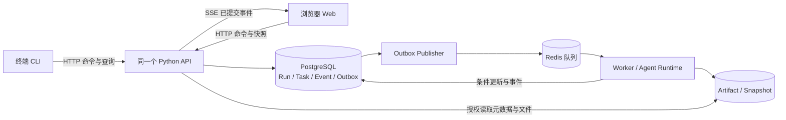

# 终端与 Web 协同、数据一致性及项目治理基线

> 状态：架构决策与实施门槛。适用于“在终端开发和操作 Agent，在 Web 查看与控制工作”的目标。当前仓库仅实现 Phase 1 的 Schema、状态转换、静态计划校验和 CLI；本文中的 API、数据库和事件流是待实现方案。

## 1. 先区分四种“同步”

| 内容 | 权威来源 | 终端与 Web 如何看到同一内容 | 不能依赖的方式 |
| --- | --- | --- | --- |
| 源代码、Prompt、Manifest、Policy 配置 | Git 提交与发布版本 | 开发时保存文件后由前端开发服务器刷新；运行时展示当前发布版本/提交号。新版本通过构建与部署生效。 | 把编辑器里未保存的内容当作已部署配置；运行中悄悄替换旧 Run 的版本。 |
| 未启动的计划草案 | P0：显式导入/导出的 JSON；后续：服务端草案库 | 终端与页面都通过同一草案格式导入/导出；有服务端草案库后统一走 API 并检查版本。 | 默默监视工作目录，把每次文件改动直接变成执行计划。 |
| Run、Task、审批和事件 | PostgreSQL 中的状态、事件和审计记录 | CLI 与 Web 均向 API 发命令、从 API 读状态；Web 订阅已提交事件。 | 让 CLI 写一份 JSON、浏览器写另一份；以终端输出或 SSE 连接本身作为事实来源。 |
| 报告、补丁、证据、工作区快照 | 不可变 Artifact/Snapshot 对象及数据库中的元数据和 SHA-256 | API 返回受权引用；下载或预览时核对所有者、版本与哈希。 | 浏览器直接读取 Worker 工作目录；把可变宿主文件当作最终产物。 |

开发时看到代码更新，与运行时看到 Agent 结果，是两条不同链路。**只有已保存、已校验、已提交到共同后端的数据才保证被两端一致看到。** 普通终端命令的 stdout 不会自动变成 Agent 事件；需要展示时，由 Runner 捕获、脱敏、关联 `run_id/task_id/trace_id` 后写入事件或 Artifact。

## 2. 连接拓扑与责任边界

- **P0 本地开发**：页面开发服务器与 API 可分别启动，页面通过同源代理访问 `/api` 和 `/events`。此时 API 只提供目录、计划校验等静态能力；CLI 仍可单独校验示例。端口是环境配置，不写进计划数据。
- **P1 单 Agent 运行**：API 与 Worker 可先在同一部署中实现明确的服务边界，但 Run/Task/Event 落 PostgreSQL 后才对外宣称“可恢复”。Web 和 CLI 不直接连接数据库、Redis 或 Worker。
- **P2 之后**：SSE 用于服务端向浏览器推送状态变化；创建、取消、审批等命令仍使用 HTTP。SSE 是单向通道，不能替代命令 API。断开 SSE 不应停止后台 Run。[浏览器 EventSource 说明](https://developer.mozilla.org/en-US/docs/Web/API/EventSource)
- **本机与远端**：本机默认仅监听 loopback；多设备访问时经 HTTPS、身份认证和明确的 Origin/CORS 策略开放。开发服务器刷新或 API 重启会断开连接，客户端必须重连并补取数据。

## 3. 一致性合同：提交、读取、推送

### 3.1 一次命令只产生一份事实

1. CLI 和 Web 使用同一应用服务层。CLI 可以调用 HTTP API，或在离线校验场景直接调用纯 `PlanValidator`；任何**持久 Run 操作**必须经过同一授权、状态机和 Repository。
2. 命令带 `command_id`/幂等键。`POST /runs`、取消和审批重复提交时返回已有结果或明确冲突，不能重复创建或执行。
3. Task/Run 状态、预算、事件和审计在同一数据库事务中提交。Phase 2 可按蓝图先用进程内派发；Phase 4 引入队列时，待投递 Outbox 也必须进入同一事务。API 只在提交成功后回成功；事件流也只发布已提交事实。[PostgreSQL 事务说明](https://www.postgresql.org/docs/current/tutorial-transactions.html)
4. 并发修改携带 `expected_status` 与 `state_version`；条件更新影响 0 行时返回 `409 Conflict` 和最新版本，界面重新获取再提示用户。终态不会被页面或 CLI 直接改写。
5. `Event.sequence` 在每个 Run 内按提交顺序分配，并对 `(run_id, sequence)` 建唯一约束。写事件时锁定该 Run 的序号记录，在同一事务中递增并写状态；不能先用独立、可能跳号的计数器冒充无缺口序列。

### 3.2 首次打开与断线重连

1. `GET /runs/{id}/view` 返回来自一致读取点的 Run、Task、最近事件及 `event_cursor`；也可由多个查询组成，但服务端须定义同一快照边界。
2. 浏览器订阅 `GET /runs/{id}/events/stream?after=<event_cursor>`。服务端先回放数据库中比游标新的事件，再持续推送新事件；每条 SSE 的 `id` 对应该 Run 的事件序号。客户端按 `event_id` 去重、按 `sequence` 排序。
3. SSE 重连时优先使用浏览器的 `Last-Event-ID`；若断开太久、游标过期、发现序号缺口或服务端重启，重新获取完整快照与事件游标。界面显示“重连中/数据已同步”状态，不能猜测任务进度。[FastAPI SSE 与断线续传说明](https://fastapi.tiangolo.com/tutorial/server-sent-events/)
4. 即使事件流延迟，HTTP 快照仍能给出已提交的权威状态。页面可短暂落后，不允许比数据库更早宣布成功。需要跨页面或跨设备的草案并发编辑时，另设草案版本与冲突提示；P0 的文件草案不承诺自动协同编辑。

**保证级别**：数据库内的状态、事件和 Outbox 保证事务一致；页面最终收敛到已提交状态。SSE 连接、Redis 投递与外部工具副作用不能宣称天然“恰好一次”，要用回放、去重、幂等与人工核对兜底。

## 4. 持久性、版本与文件治理

- **进程生命周期**：关闭终端窗口、刷新页面或断网，不应删除已持久化 Run。只有仍在终端前台且未落库的 P0 命令才随进程结束。Worker 重启后按数据库状态与 lease 核对恢复。
- **队列与数据库双写**：同一事务写状态与 Outbox，Publisher 可重复投递，Worker 条件领取和幂等提交。Redis 清空后从 PostgreSQL 重建待处理任务；这是原蓝图 Phase 4 的验收内容。
- **工作区文件**：Run 启动时记录代码提交、计划版本、Manifest/Prompt/Policy/模型配置版本，以及输入快照或哈希。运行中外部修改工作区时，已有 Run 仍使用固定版本；若快照与 Checkpoint 哈希不一致，暂停恢复并报告冲突。
- **产物**：补丁、报告和较大日志落不可变对象；事件仅放安全摘要与引用。数据库备份和 Artifact 备份要配套，恢复时抽样核对哈希。事件保留期限、归档和删档规则须在真实部署前定稿，且不得早于页面的断线补取窗口。
- **数据库迁移**：Schema 和 API 变更先做兼容迁移，再更新服务，最后清理旧字段；活跃 Run 按启动时固定的版本完成或进入显式迁移/停止流程。前端发现不支持的 `schema_version` 时显示升级要求，而非忽略字段。

## 5. 其他容易遗漏的风险及控制

| 风险 | 触发场景 | 控制与验收 |
| --- | --- | --- |
| 开发热更新误伤运行 | 保存代码导致 API/Worker 重启 | 开发数据与演示数据隔离；运行任务由持久 Worker 承载。重启后浏览器重连，已提交结果仍可查。 |
| 终端与页面同时操作 | 两端同时取消、审批或修改草案 | 幂等键、版本条件更新、409 冲突和审计操作者；同一动作仅生效一次。 |
| 页面显示旧结果 | 网络中断、事件漏收、浏览器缓存 | 快照加游标、事件回放、缺口重同步；给页面标注最近同步时间。 |
| 文件结果与运行状态分叉 | Worker 写文件后宕机，数据库未提交 | 候选文件留在隔离工作区，验证与 Snapshot 引用提交后才作为正式产物显示；恢复时校验哈希。 |
| 多用户或浏览器越权 | 本机服务意外监听公网，跨站请求或共享电脑 | 默认 loopback；部署时认证、最小权限、受限 Origin、写操作防跨站请求、服务端脱敏。 |
| 浏览器直接执行命令 | 画布节点填写任意 Shell 或路径 | UI 只提交结构化计划；Policy/Tool Gateway/Sandbox 执行白名单动作。 |
| 日志体积与敏感信息 | 把 stdout 全量塞入事件流 | 日志截断、脱敏与分段 Artifact；Event 保持现有 8 KiB 限制；限制页面保留行数。 |
| 事件或 API 不可用 | SSE 中断、数据库暂不可达 | 页面区分“连接异常”和“运行失败”；只读缓存标注过期，不接受无法确认的写入成功提示。 |
| 外部副作用重放 | 重试发生在外部写入已成功后 | 稳定幂等键、读后核对、`WAITING_REVIEW`；不把恢复等同于盲目重试。 |

## 6. 项目实施门槛与责任划分

| 阶段 | 完成前必须回答或验证的事项 | 验收证据 |
| --- | --- | --- |
| P0：计划工作台 | 定稿草案 JSON、导入信任边界、目录接口、结构化校验错误；Web 与 CLI 对同一示例计划给出一致报告。 | 示例 DAG、循环/缺失依赖/权限冲突的页面与 CLI 对照记录。 |
| P1：单 Agent Runtime | API/CLI 共用服务层；Run/Task/Event 原子持久化；命令幂等与版本冲突；API 重启后可查。进程内派发须保留将来接队列的边界。 | 两客户端并发命令测试、重启恢复测试、事务失败无半成品事件。 |
| P2：多 Agent 与实时展示 | 快照游标、SSE 回放、事件去重、DAG 状态映射；计划版本固定。 | 断网/重连/刷新后页面与数据库一致；并行任务状态正确。 |
| P3：故障恢复与安全 | Outbox、Worker lease、Snapshot 哈希、审计、审批和副作用核对。 | 杀 Worker、重复投递、Redis 清空、对象缺失及审批重试的故障注入。 |

**职责**：Runtime/Repository 拥有状态转换与事务；API 拥有认证、授权、输入合同和读取投影；Worker 拥有执行与恢复；Web 拥有交互、展示与重连；CLI 是同一服务的开发与自动化入口。每个跨层变更必须同时核对 Schema、API 响应、Web 状态映射、CLI 行为和故障测试。

**变更准入**：每个功能说明“权威数据在哪里、谁可写、何时提交、断线如何补、重复请求如何处理、怎样验收”。完成一个纵切后再扩展 Agent 类型或基础设施。P0 的页面不能把静态示例冒充实时运行；P1 不能因 Web 已显示成功而跳过 Verifier 和数据库事务。

## 7. 当前立刻可执行的工作项

1. 将 P0 的草案与已授权合同区分：外部导入使用 `ContractRequest` 形状，示例 `contract.json` 只作为受信内部合同展示。
2. 为 `PlanValidator` 定义稳定的错误码、字段路径和相关 `task_ids`，让 CLI 与 Web 可定位同一错误；现有字符串异常可暂保留供人阅读。
3. 定义 `GET /catalog`、`POST /plans/validate` 的最小 API 合同，并用当前示例做一套 CLI/API 等价验收。
4. 在 Phase 2 实现 Run/Task/Event Repository 时一并定义 `state_version` 条件更新、事件序号唯一约束和 `command_id` 幂等记录。
5. 在接入运行详情页前完成快照游标与事件回放；展示实时性之前先证明断线后能追上数据库。
